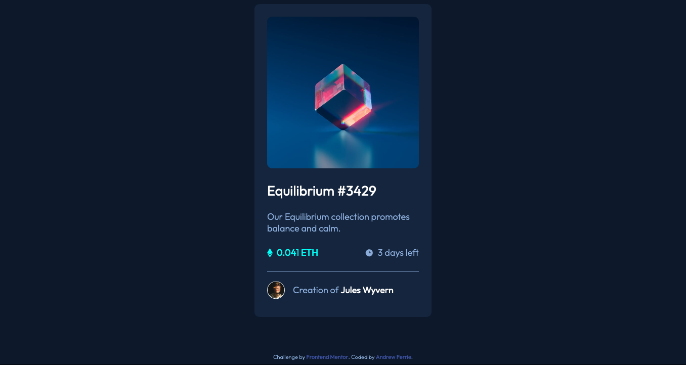

# Frontend Mentor - NFT preview card component solution

This is a solution to the [NFT preview card component challenge on Frontend Mentor](https://www.frontendmentor.io/challenges/nft-preview-card-component-SbdUL_w0U). Frontend Mentor challenges help you improve your coding skills by building realistic projects. 

## Table of contents

- [Overview](#overview)
  - [The challenge](#the-challenge)
  - [Screenshot](#screenshot)
  - [Links](#links)
- [My process](#my-process)
  - [Built with](#built-with)
  - [What I learned](#what-i-learned)
- [Acknowledgments](#acknowledgments)

## Overview

### The challenge

This challenge was proposed by my teacher on the Bath Spa University Web Development Course. 

Users should be able to:

- View the optimal layout depending on their device's screen size
- See hover states for interactive elements

### Screenshot

### Links

- Solution URL: [Add solution URL here](https://andyferrie.github.io/nft-preview-card-component-main/)

## My process
### Built with

- Semantic HTML5 markup
- CSS custom properties
- Flexbox

### What I learned

I struggled a bit with how to add the hover effect on the image but eventually solved it with an absolutely positioned div placed on top. I was also thrown a bit by some standard margins so may need to start getting into the habit of using a reset style sheet.

## Acknowledgments

I found it useful to check dimensions using Adobe XD which is something I picked up watching a tutorial by Coder Coder. You can view her channel here:  https://www.youtube.com/c/TheCoderCoder

